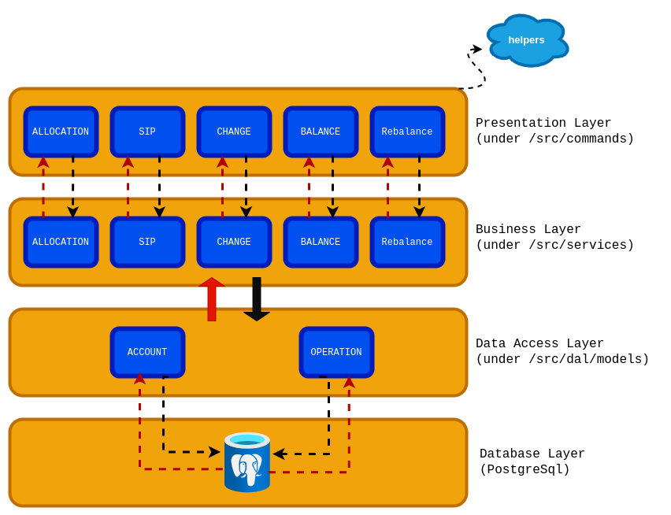
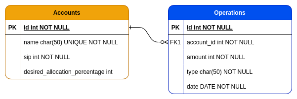

# MyMoney

```bash
      ___                       ___           ___           ___           ___                 
     /__/\          ___        /__/\         /  /\         /__/\         /  /\          ___   
    |  |::\        /__/|      |  |::\       /  /::\        \  \:\       /  /:/_        /__/|  
    |  |:|:\      |  |:|      |  |:|:\     /  /:/\:\        \  \:\     /  /:/ /\      |  |:|  
  __|__|:|\:\     |  |:|    __|__|:|\:\   /  /:/  \:\   _____\__\:\   /  /:/ /:/_     |  |:|  
 /__/::::| \:\  __|__|:|   /__/::::| \:\ /__/:/ \__\:\ /__/::::::::\ /__/:/ /:/ /\  __|__|:|  
 \  \:\~~\__\/ /__/::::\   \  \:\~~\__\/ \  \:\ /  /:/ \  \:\~~\~~\/ \  \:\/:/ /:/ /__/::::\  
  \  \:\          ~\~~\:\   \  \:\        \  \:\  /:/   \  \:\  ~~~   \  \::/ /:/     ~\~~\:\ 
   \  \:\           \  \:\   \  \:\        \  \:\/:/     \  \:\        \  \:\/:/        \  \:\
    \  \:\           \__\/    \  \:\        \  \::/       \  \:\        \  \::/          \__\/
     \__\/                     \__\/         \__\/         \__\/         \__\/                

```

  

MyMoney is a platform that lets investors track their consolidated portfolio value across equity, debt, and gold. It also lets them perform various operations on their portfolio, such as rebalancing, SIP, etc.

[Trello board here](https://trello.com/invite/b/GhqNsRRr/ATTI4df5d7b4c425a8af17e2dcefd5619d2567D37B76/mymoney-challenge)

# Setup 🚀

## 1. Using Docker 🐳

build the docker image

```bash
docker build . -t my-money
```

once done, you can start interacting with the app

```bash
docker run my-money node index.js ALLOCATE 6000 3000 1000
```

If this is the **first time** to run the app, you will need to run migrations:

```bash
docker run my-money npx sequelize-cli db:migrate
```
  
And you are ready to go 🚀

## 2. Without Docker ⚙️

For the application, you will need `node` version 16.10 or more, and `yarn` to be installed. Run this command to install dependencies

```bash
yarn
```

```bash
npx sequelize-cli db:migrate
```
  
After that, you should be ready to go 🚀

# Testing 🧪

To run the test suite, run this command:

```bash
yarn test
```

For coverage report, run this command:

```bash
yarn coverage
```

## Notes

- I followed **TDD** approach, while keeping an eye on high test coverage (currently it's at 100%)

- I followed **Trunk Based Development**, by utilizing the `main` branch. To ensure no broken code is pushed to remote, I made use of [husky](https://typicode.github.io/husky/) package to implement a `pre-push` hook, that runs the test suite and only proceed if it's green (it also runs lint as a `pre-commit` hook)

- I have used [mocha](https://mochajs.org/) for testing, [chai](https://www.chaijs.com/) for assertion, [sinon](https://sinonjs.org/releases/latest/stubs/) for stubbing and [nyc](https://github.com/istanbuljs/nyc) for code coverage.

- To implement e2e tests, I use memory database, so I don't need to worry about cleaning the database after each test. I also use `sinon` to stub the `console.log` function, so I can assert on the output.

### Report

```bash
=============================== Coverage summary ===============================
Statements   : 100% ( 829/829 )
Branches     : 100% ( 43/43 )
Functions    : 100% ( 237/237 )
Lines        : 100% ( 777/777 )
================================================================================
```

# Design 📐✏️

## Layered Architecture



I followed the layered architecture approach, where each layer has a specific responsibility. This approach helps to keep the code clean and easy to maintain. It also helps to keep the code testable, as each layer can be tested in isolation.

### Presentation Layer (Commands)

This layer is responsible for interacting with the user. It's the entry point of the application. It's also responsible for validating and parsing the user input, then passing it to the business layer.

### Business Layer (Services)

This layer is responsible for the business logic. It's the heart of the application. It's responsible for orchestrating the data flow between the data layer and the presentation layer.

### Data Access Layer (DAL)

This layer is responsible for interacting with the database. It's responsible for creating the database connection, defining the database schema, and providing an interface for the business layer to interact with the database.

### Helpers

This part is not a layer per se, but it's a collection of helper functions that are used across the application. It's responsible for providing utility functions that are used by the presentation layer.

## Database Schema



# Database performance 📊

## Setup

I setup a postgres to test the database performance. Although I'm using SQLite for development, I wanted to test the performance on a real database.

To see the database performance, I inserted **3 million records** into the `Operations` table, one million for each account type (equity, debt, gold).

```sql
insert
  into
  "Operations" 
   ("amount", "accountId", "date", "type", "createdAt", "updatedAt")
  select
   floor(random() * 100),
   1, -- account id, repeat this query for each account id
   (DATE '2023-01-01' + (floor(random() * 365) || ' days')::interval) AS random_date,
   'change',
   NOW(),
   NOW()
  from
   generate_series (0,999999);
```

Then I ran the following query, which is executed with the **BALANCE** command. I added `explain analyze` before it, to see the execution plan and the time it took to execute the query.

```sql
explain analyze SELECT "Account"."id", "Account"."name", "Account"."monthlyInvestment", "Account"."desiredAllocationPercentage", sum("amount") AS "balance" FROM "Accounts" AS "Account" LEFT OUTER JOIN "Operations" AS "operations"
ON "Account"."id" = "operations"."accountId" WHERE "operations"."date" <= '2023-02-16' GROUP BY "Account"."id";
```

## Results

I ran the `BALANCE` command, which runs the following query

and got the following results

- **Workers Planned/Launched**: There are two planned and launched workers for parallel processing.
- **Sort**: The data is sorted based on the "id" column.
- **Sort Method**: Quicksort is used for sorting.
- **Parallel Seq Scan**: A parallel sequential scan is performed on the "Operations" table to filter rows based on the "date" column.
- **Planning Time**: The query planning time is **0.961 milliseconds**.
- **Execution Time**: The query execution time is **176.856 milliseconds**.

These results are acceptable. However, we can improve the performance in the future by adding an index on the `date` column, but it's better to keep it as it is for now, as it needs to be tested with a larger dataset.

# Usage ⭐

- To see a list of available commands, run this command

```bash
node index.js --help


A CLI for investment fund management

Options:
  -V, --version                          output the version number
  -h, --help                             display help for command

Commands:
  ALLOCATE <equity> <debt> <gold>        receives the initial investment amounts for each fund.
  SIP <equity> <debt> <gold>             receives investment amount on a monthly basis for each fund.
  CHANGE <equity> <debt> <gold> <month>  receives the monthly rate of change (growth or loss) for each fund type. A
                                         negative value represents a loss.
  BALANCE <month>                        receives a month name
  REBALANCE                              receives receives no additional inputs
  help [command]                         display help for command
```

- when passing a negative value (for example the `CHANGE` command), you need to pass double dash `--` to signify the end of options, so it would be like this

```bash
node index.js CHANGE -- 10.00% 8.00% -5.00% JUNE
```

# Limitations 🏋🏽

- This software deals with one year only (it's assumed to be `2023`, but this can be easily changed from `config.js` file). It should be relatively easy to extend it to handle multiple years.
